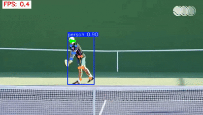

# 🎾 Shot Classification App

## 🏓 Output Examples

### Forehand | Serve | Backhand

<p align="center">
  
  
  
</p>


### Setup and Usage Instructions

---

## 📁 Project Structure

```
Shot Classification/
├── best_lstm_model_fg.pth         # Trained LSTM model
├── yolo11n-pose.pt                # YOLO Pose model (Ultralytics)
├── app.py                         # Streamlit application (UI)
├── lstm_model_training.py         # Model training script
├── requirements.txt               # Required packages
```

---

## ⚙️ Installation Steps

### **Step 1: Install Python**

Make sure Python 3.8–3.11 is installed:

```bash
python --version
```

If not installed, download from:  
👉 [https://www.python.org/downloads/](https://www.python.org/downloads/)

---

### **Step 2: Create Virtual Environment (Recommended)**

```bash
# Windows
python -m venv venv
venv\Scripts\activate

# macOS/Linux
python3 -m venv venv
source venv/bin/activate
```

---

### **Step 3: Install Dependencies**

```bash
pip install -r requirements.txt
```

---

### **Step 4: Download Model Files**

- `yolo11n-pose.pt` → from Ultralytics Releases  
- `best_lstm_model_fg.pth` → your trained LSTM model  

Place both in the same directory as `app.py`.

---

### **Step 5: Run the App**

```bash
streamlit run app.py
```

---

## 🎯 Using the App

### 📷 Webcam Mode

- Click **Start Webcam**
- Top-left: **FPS** (white background, blue text)
- Top-right: **Shot Type** (white background, red text)

---

### 📼 Upload Video Mode

- Upload a video file (`.mp4`, `.avi`, `.mov`)
- Each frame is processed with live predictions

---

## ⚠️ Notes

- Make sure webcam permission is granted if using webcam mode
- The model uses a 30-frame buffer for prediction
- Performance may vary depending on lighting and pose clarity

---

<div align="center" style="margin-top: 100px;">

## 💬 **Anything you need assistant, let me know Contact: mammarali299@gmail.com**

</div>
